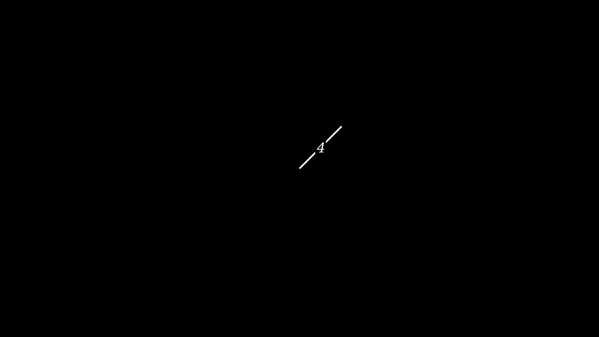
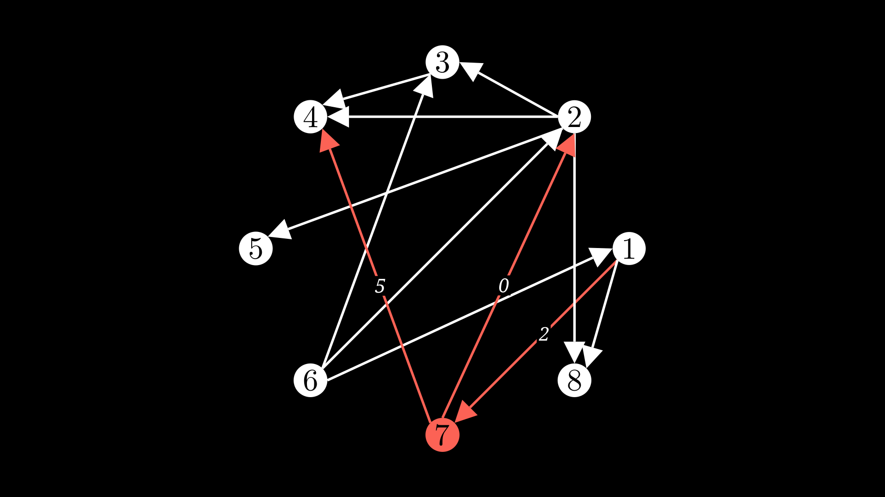
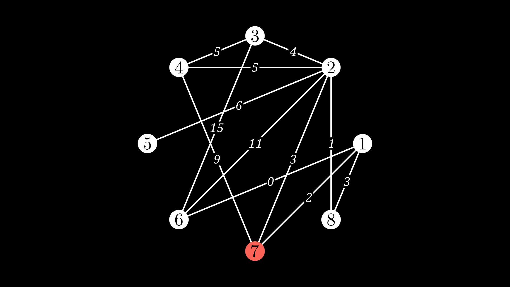

# Manim Weighted Line
A plugin for creating weighted network graphs in Manim

## Table of contents:
- [Manim Weighted Line](#manim-weighted-line)
  - [Table of contents:](#table-of-contents)
  - [Installation.](#installation)
  - [What does Manim-Weighted-Line do?](#what-does-manim-weighted-line-do)
  - [How do I use Manim-Weighted-Line?](#how-do-i-use-manim-weighted-line)
  - [Take a look at the examples](#take-a-look-at-the-examples)
  - [How to contact](#how-to-contact)

## Installation.

You can install via pip:

```
pip install manim-weighted-line
```

You can also clone the repo and install it from here:

```
git clone https://github.com/mutable-learning/manim-weighted-line.git
cd manim-weighted-line
python -m pip install .
```

or

```
git clone https://github.com/mutable-learning/manim-weighted-line.git
cd manim-weighted-line 
python -m pip install -e .
```


## What does Manim-Weighted-Line do?
This is a simple plugin that is designed to meet the needs of manim users who want to
 create weighted network graphs in Manim. There is no easy way to add weightings to
 the edges of graphs in Manim, so this plugin provides a simple solution for both 
 undirected and directed graphs.

## How do I use Manim-Weighted-Line?
After installing the plugin, you can start using it by running:


```
from manim import *
from manim_weighted_line import *

```
for example

```
from manim import *
from manim_weighted_line import *

class SimpleExample(Scene):
    def construct(self):
        weighted_line = WeightedLine(
            0,
            1,
            weight=4,
        )
        self.add(weighted_line)
```
and we get



To use this line in your graphs, pass the configuration to the edge object and use the WeightedLine as the edge_type.

```
from manim import *
from manim_weighted_line import *

class WeightedGraph(Scene):
    def construct(self):
        vertices = [1, 2, 3, 4, 5, 6, 7, 8]
        edges = [(1, 7), (1, 8), (2, 3), (2, 4), (2, 5),
                 (2, 8), (3, 4), (6, 1), (6, 2),
                 (6, 3), (7, 2), (7, 4)]
        g = DiGraph(vertices, edges, layout="circular", layout_scale=3,
                  labels=True, vertex_config={7: {"fill_color": RED}},
                  edge_type=WeightedLine,
                  edge_config={(1, 7): {"stroke_color": RED, 'weight': 2},
                               (7, 2): {"stroke_color": RED, 'weight': 0},
                               (7, 4): {"stroke_color": RED, 'weight': 5}})
        self.add(g)
```

and we get



If you are using NetworkX to create your graph, you can use the WeightedLine as the edge_type and pass it config options in the edge_config dictionary:

```
from manim import *
from manim_weighted_line import *
import networkx as nx

class NetworkXGraph(Scene):
    def construct(self):
        G = nx.Graph()
        G.add_nodes_from([1, 2, 3, 4, 5, 6, 7, 8])
        G.add_weighted_edges_from([(1, 7, 2), (1, 8, 3), (2, 3, 4), (2, 4, 5), (2, 5, 6),
                 (2, 8, 1), (3, 4, 5), (6, 1, 0), (6, 2, 11),
                 (6, 3, 15), (7, 2, 3), (7, 4, 9)])
        g = Graph(G.nodes, G.edges, layout="circular", layout_scale=3,
                  labels=True, vertex_config={7: {"fill_color": RED}},
                  edge_type=WeightedLine,
                  edge_config= {(u, v): G.get_edge_data(u, v) for u, v in G.edges},
        )
        self.add(g)
```

and we get



## Take a look at the examples

Inside the examples folder, you can find some examples of how to use the plugin with different types of graphs, both undirected and directed. You can see how to configure different options for the weight label and the background. Check them out!


https://github.com/mutable-learning/manim-weighted-line/assets/112732721/92efecf1-097f-4431-aa12-d1f7030abe36

https://github.com/mutable-learning/manim-weighted-line/assets/112732721/70c08377-817d-4a93-b2f7-2b5d94e52bae

https://github.com/mutable-learning/manim-weighted-line/assets/112732721/54ce7490-a04e-4842-9c4f-4c35e83d128e


## How to contact
You can open issues and pull requests, but if you want to contact me directly you can go to:
- Email: MutableLearning@gmail.com
- YouTube: https://www.youtube.com/channel/UCMq14ztdWTLvhCR2j4h_3zA
